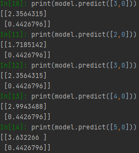
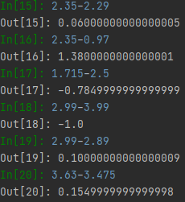

## February 5th Assignement (J.Mo Yang)

1) Difference between traditional programming and ML
* Traditional programming has rules and data that goes and the answers that comes out. On the other hand, in machine learning, we input answers and data for the machine to figure out the rules. Therefore, in machine learning programmers get a lot of data and establish a rule that will match one to the other. Neural networks deal in probability, give an likelihood of an answer being correct.  ML has parameters instead of hardcoded values, but it learns those parameters from the data over time. Therefore, it is a general function that learns how to behave. 

2) Prediction model for output value of 7 
* [21.997519]
* [21.999979]
   * The output for the both are similar but not the same. As the neural network 'learns' the rules of the data, the loss function decreases becuase it is simplying 'learning' to improve the results of the output (the more the neural network is run, the more accurate the output gets).

3) Housing Model 
* As the image shows (below), the worst buy is the 284 Church St, a 4 Bedroom, 3 Bathroom house priced at $399,000. The best buy is the 160 Holly Point Rd, a 3 Bedroom, 1 Bathroom house priced at $97,000. The model I have created finds the relationships between the number of bedrooms and the price of the houses, leading to finding a rule that determines the price of the house based on the number of bedrooms. However, this is not the most accurate model since there are other factors that contribute to the price of houses such as, the size (square feet), the number of bathrooms, the location of the house and the year it was built in. 
  
                                                                    
  
