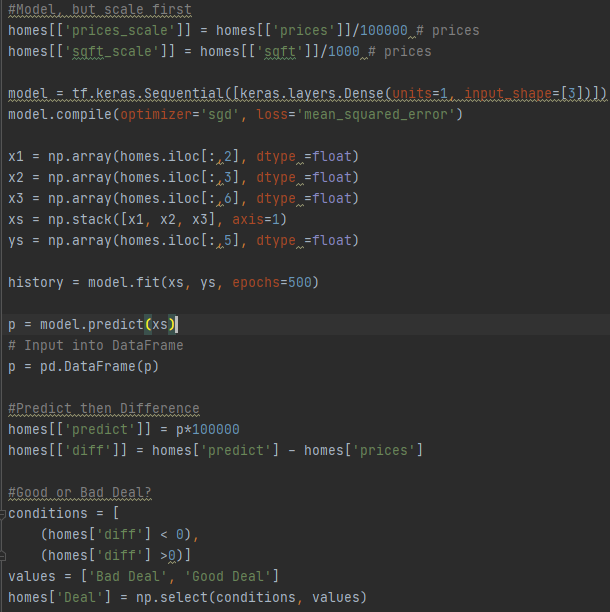
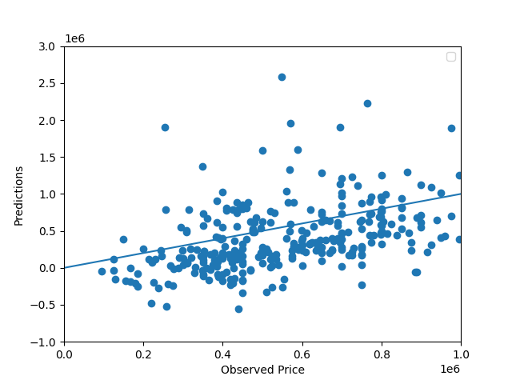
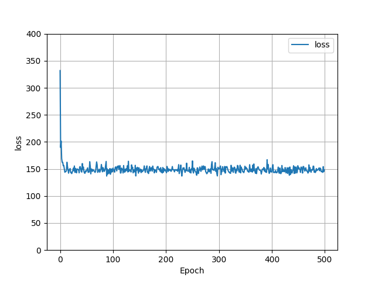

# Project 1 (J.Mo Yang)

### Selected City: 
* #### Washington D.C
    * I have originally had 400 data points scrapped from Zillow using their URL. The data scrapped were then translated into a Pandas Dataframe in order for me to easily train the neural network model that was first introduced in the first week of class. However, there were 8 data points with missing information (a couple being studios, empty lots/land and others missing number of bath and bedrooms). Therefore, I have dropped the 15 data points, leaving us with a total of 385 data points with its price, number of beds, baths and the square footage of the house. 

* #### Possible False Information Provided By Zillow (?)
    * Also, I have noticed that the data that were scrapped showed false information. For example, 1855 Calvert St NW APT 201, Washington, DC 20009 is a 2 bed, 1 bath 749 sqft apartment in D.C, however, according to the zillow_scrape.py script, the same apartment is listed as a 4 bed 7 bathroom with 6407 sqft. Therefore, before I moved on further into training my neural network, I checked on the website to make sure all data points are accurate. Weirdly, the prices of the data I have scraped were extremely accurate, matching almost all addresses but the number of baths, bedroom and the squarefootage of some data points were off by a mile. At first I thought that I have done something wrong in the script that it would scrape information of a different homes in D.C or the apartments have different units in which it has different layout. However, there were no patterns to the data points possibly shifting by one or multiple rows. Also, the apartment unit number is given, which means that the number of bed and bathrooms should associate with the given unit found on Zillow. 
         * Data seemed odd --> Checked on Zillow, found out that address and prices match the data scrapped, but number of bath/beds and square footage were extremly off by random numbers.
            * Another example:  1111 Oates St NE Washington DC 20002 listed as $850,000 with 4 bed, 4 bathroom, 1700 sqft home, zillow_scrape.py shows as 1 bed, 1 bath, 616 squarefoot with the same address and price

  * The descriptoin of the data points are as shown below after it was screened. 
    * | Statistics | Price | # of Bed | # of Bath | Sqft |
      |------------|-------|----------|-----------|------|
      | Mean| $1,291,785 | 2.94 | 2.78 | 1,977.5 |
      | Min | $95,009 | 1 | 1 |  331 | 
      | 25% | $428,749.75 | 2 | 2 | 956 |
      | 50% |  $631,950 | 3 | 2 | 1344.5 |
      | 75% | $899,900 | 3.25 | 3 | 1984 |
      | Max |  $18,000,000 | 11 | 17 | 13687 | 

   * As you can see from the data table as well as Figure 1, the distribution of the data points are extremly wide. However, I did not remove the outliers as the Sqft of the houses in Washington D.C could possibly be less impacted due to their dense population. 

### A description of your model architecture
* I have created a simple model based on the model we have gone over in class, using TensorFlow package. It uses number of bed rooms, bathrooms and square footage to train the model (3 layers of input). I have divided/scaled the data point for the prices and square footage by dividing the prices by 100,000 and sqft by 1,000. Then, the "learns" with the input datas to produce the optimal prices based on the number of beds, bathrooms and square foot. Then the predicted prices are inputted into a column called 'predict'. Then I calculated the price difference between the observed value from Zillow and the predicted value. Lastly, I created a new column called 'Deal' to distinguish whether or not the observed value is a 'Good Deal' or a 'Bad Deal'. There are 271 houses that were labeled as a "Good Deal" compared to the 114 houses that were labeld as a "Bad Deal"
   
   
 

### An analysis of your model output
*  Also, we can see that, roughly, the observed prices are positively correlated to the predicted values. However, there are several outliers in the scatter plot where the predicted prices are way higher than the observed prices. As you can tell, the performance of the model was poor, as the Mean Squared Error was:  1494717779858.386. This MSE is super high, meaning our model did not perform well because MSE of 0 means the model. Hence MSE of 1494717779858.386 shows us that the model is extremely biased. Lastly the mean absolute error was 558,928, which means that on average the prediction made by the model was off by $558,928. The mean housing value was $1,291,785, and if the model's MAE was 558,928, it is close to half of the mean housing value. 
  
  

* As you can see from the plots below, the loss function is pretty high also, despite the fact that I have cleaned out all the data one by one through Zillow.com. This means that there are errors across the samples/output created by the input data points. I do think that this is mainly caused by the geographical locations of our data point. Within Washington D.C there are places where housing prices are higher than that of other neighborhoods. Nevertheless, it will be hard to distinguish whether it is a expensive neighborhood or not based on zipcode, because zipcodes covers a large land. 
  
                                 

### An analysis of the output that assesses and ranks all homes from best to worst deal
* The good deals are defined by the positive difference between the predicted and the observed price (Predicted - Observed = Positive/"Good Dea" --> observed value is less than the predicted price). On the other hand, the bad deals are defined by the negative difference between the preticed and the observed price (Predicted - Observed = Negative/"Bad Dea" --> observed value is greater than the predicted price) 
* If we generalize about the results , the Top 10 "Good Deal" houses has at least 4 bed and 4 bath rooms and most of them being over $1 Million in observed prices and greater than 3,000sqft. However, the Top 10 "Bad Deal" houses have similar characteristics. Nevertheless, the Top 10 worst deals are huge mansions, with most of them being larger than 5,000sqft. If we think about how D.C is a compact city, buying a huge mansion is obviously going to be extremely expensive. Interestingly, the most expensive house out of the data set is the worst deal out of 385 houses that were scrapped from Zillow.com. Also, as we can see, the zipcode doesn't really tell us anything (despite the data below being only two data sets from 385) as both the best and the worst deal are from the same zipcode. 

   *  Best Deal
      *  | Observed Price | Address | # of Bed | # of Bath | Sqft | Predicited Price | Difference | Deal |
         |-------|---------|----------|-----------|------|------------------|------------|----|
         |$3,197,000 | 2005 48th St NW Washington DC 20007 | 6 | 6 | 8,050 |	$6,285,348.511	| $3,088,348.511	| Good Deal |
   * Worst 
      *  | Observed Price | Address | # of Bed | # of Bath | Sqft | Predicited Price | Difference | Deal |
         |-------|---------|----------|-----------|------|------------------|------------|----|
         |$18,000,000 |	3150 S St NW #PH2C & 1M Washington DC 20007 | 4 | 7 |	6,407 | $5,635,736.465 |$-12,364,263.53 | Bad Deal |
* [CSV With Results](jy_homes_DC.csv) 
