# Project 3 (April 18th) 

## Country: Albania 

### About the Data 
* This project holds raster data sets and a single shape file from GDAM and Worldpop. I am continuing this project with the country of my choice from DHS project (Project 2). 
Albania beign a small country, I decided to run LR model and RF model on the whole entire country. The country of Albania is divided into 12 different counties and 375 units of local governance.

### Linear Regression Model 
* Using the 2015 population data for Albania, I utilitzed the linear regression model that we went over in classs. 
By splitting the data into training and testing data set with the proportion of 4/5, the model was able to predict the following number of population in Albania. 
  * 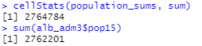  
* As we can see from the results above, the actual total population within this model of Albania is 2,762,201 and the predicted population is 2,764,784. The numbers are off by only 2,583, which is only about 1/1000 of the actual population.

* ##### Predicted Total Sums 
   
   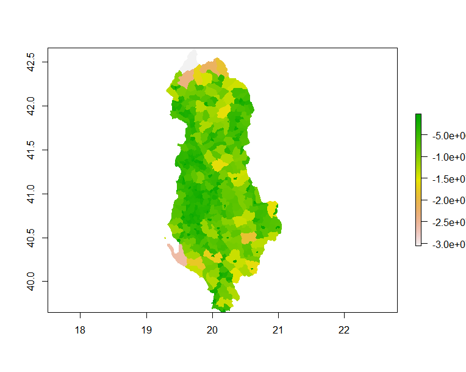                              
   
* As we can see the result from above, the predicted total sums of the population is very much similar to the actual population density map of Albania. Most of the population are concentrated in the mid-coast, land area of Albania.  

#### Results 
* ##### Population Sum
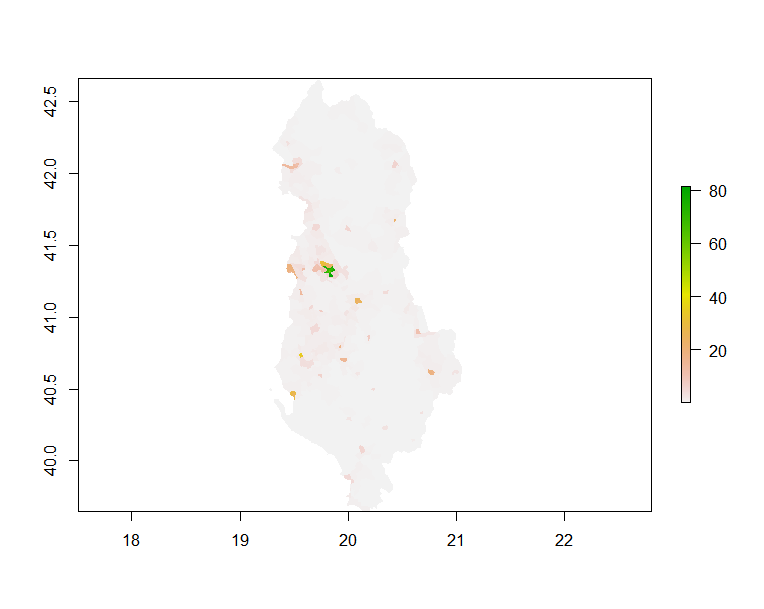 

* ##### Population Difference Between Worldpop and Predicted value
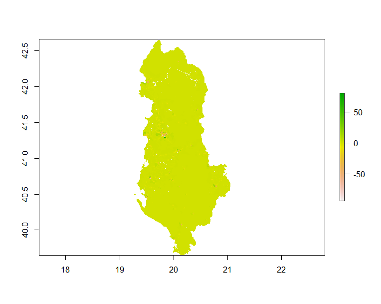 

   * As we can see from the results above, the population difference shows that the majority of the area in Albania were on point with the actual population data from Worldpop (colored in greenish-yellow color). The model did have a couple of under and over predictions, represented by the color green and redish pink colors respectively. The areas of the under and over predictions are in the areas that is in the middle of Albania and is represented, where it is presented by green in population sum plot. The area of most error or under/over prediction is around Tirana, which is the capital of Albania. Also, almost half of the population of Albania lives in Tirane and Durres. Nevertheless, the overall model was great at predicting the population of Albania, as it is shown above (total actual population of 2,762,201 and predicted population of 2,764,784). 

### Random Forest Model

* #### Model 

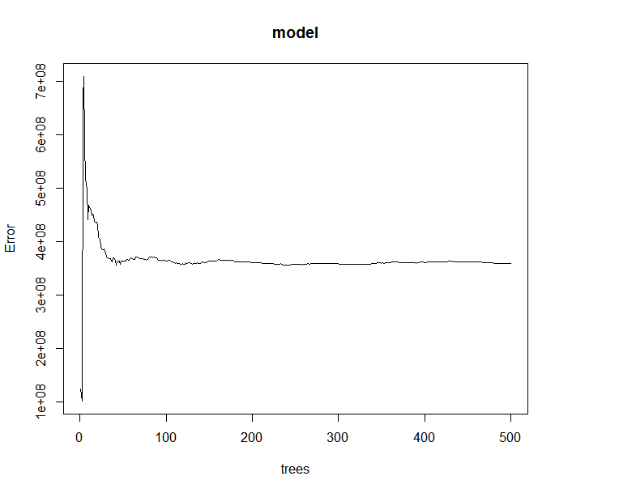 

* The model has generated the least amount of error at around 1 or 2 trees. I have tried to improve the model by trying to modify the model with different mtry numbers. 

* Modified Model (mntry = 4)

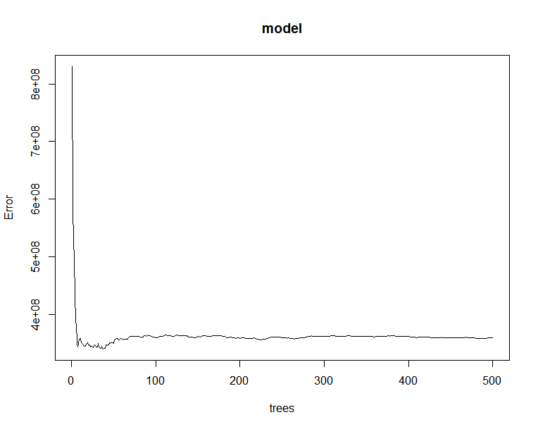 

* As we can see from the output above, the model has improved a little bit compared to the original output. mntry is the number of variables available for splitting at each tree node, which is randomly sampled as candidates at each split. This increases strength of each trees, however cannot go above the the number of variables. After trial and error, mtry = 4 came out to be the most optimal level. However, there was an error at > population_adm3 <- rasterize(alb_adm3, predicted_values_sums, field="pop15") statement. Therefore, I will be only presenting the original randomforest model we went over it in class unfortunately from now on. 

* #### Originial Model from now on

* As we can see from above, that the random forest model also did a good job of predicting the population of Albania. As we can see from the image above, the model predicted 2,764,702, where as the acutal total population is 2,762,201. Similarly to the linear regression model, this random forest model was only off by 2,501 from the actual total population.

* ##### Population Sum
 

* ##### Population Difference Between Worldpop and Predicted value
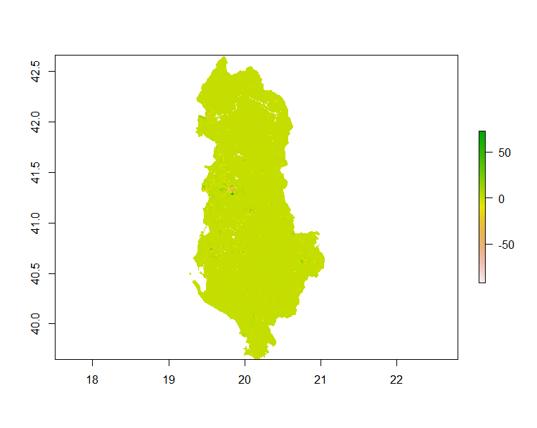 

* Similar to Linear Regression model the major under and over prediction occured at the middle of the country (near Tirana). The under and over prediction is represented by green and pinkish-red respectively. However, rest of the country are on par with the actual population data from Woldpop. 

### Difference, ME and MSE of Both Models (Not Modified outputs) 

* ##### Difference 3D (LR & RF)

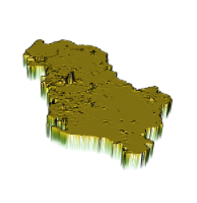                          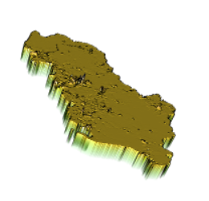 

* ##### ME 3D (LR & RF) 

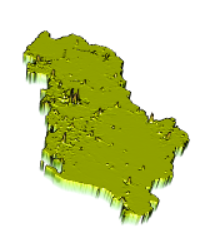                            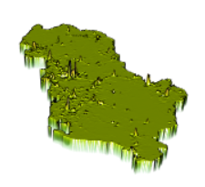 

* ##### MSE (LR & RF) 

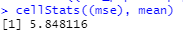                            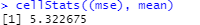

* As we can see from the images and the results above, the two models performed VERY similarly. However, we can say that the Random Forest model did perform a little bit better compared to than that of the Linear Regression model. The mean squared error of Random Forest is 5.322675, whereas the mean squared error of Linear Regression is 5.848116. Therefore, Random Forest model have performed better since it is closer to 0. However, according to the 3D plot of ME of both models, RF seem to perform worse compared to LR. Nevertheles, the difference seem to be very minimal. Also, I do not know why the MSE values came out better for Random Forest compared to Linear Regression, it is possible that I have made a mistake during the calculation process. Lastely, the errors in population prediction seems to concentrate in urban areas, mostly Tirana for both models. Therefore, in conclusion, I believe that the two model performed more similarly than different. Nevertheless, I wasn't able to plot the 3D plots for the modified RF model with mtry of 4, due to time concern. (I will be making an update as soon as possible) 

