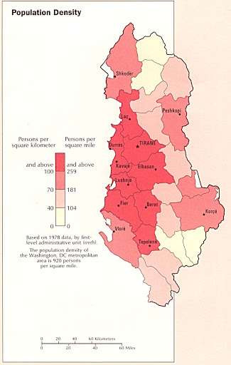

# Project 3 (April 18th) 

## Country: Albania 

### About the Data 
* This project holds raster data sets and a single shape file from GDAM and Worldpop. I am continuing this project with the country of my choice from DHS project (Project 2). 
Albania beign a small country, I decided to run LR model and RF model on the whole entire country. The country of Albania is divided into 12 different counties and 375 units of local governance.

### Linear Regression Model 
* Using the 2015 population data for Albania, I utilitzed the linear regression model that we went over in classs. 
By splitting the data into training and testing data set with the proportion of 4/5, the model was able to predict the following number of population in Albania. 
  *   
* As we can see from the results above, the model predicted 2,762,201 as the total population of Albania, where as there were a total of 2,764,784. 
* Predicted Total Sums 
    
    
* As we can see the result from above, the predicted total sums of the population is very much mimics the actual population density map of Albania. Most of the population are concentrated in the mid-coast, land area of Albania.  

#### Results 
* ##### Population Sum
 

* ##### Population Difference Between Worldpop and Predicted value
 

   * As we can see from the results above, the population sum shows that 

Using two machine learning methods predict population values at 100 x 100 meter resolution throughout your selected country
Validate the two models using different methods presented in this class
Write a report assessing the two approaches and which of the two models was more accurate
Be sure to account for spatial variation throughout your selected location and provide substantive explanations for why those variations occurred
Week 13 (4/19)
