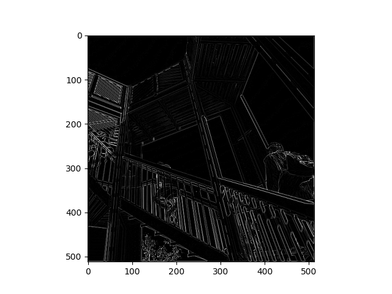

# Informal Reponse 3 (Feb. 21st) 

#### Modify the existing filter and if needed the associated weight in order to apply your new filters to the image 3 times. 
* filter = [ [0, 1, 0], [1, -4, 1], [0, 1, 0]] 

** Ji
