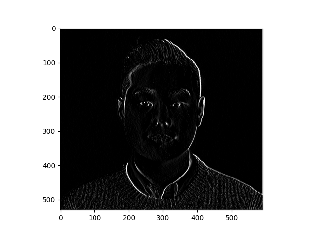
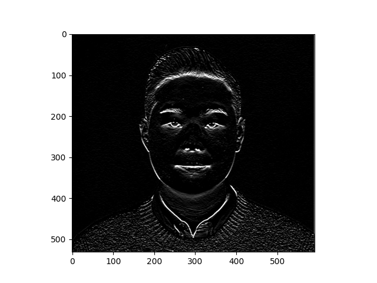
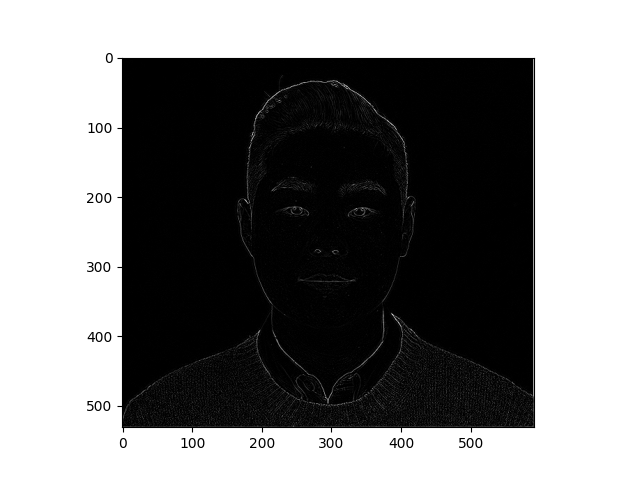

# Informal Reponse 3 (Feb. 21st) 

## Stairs

#### Modify the existing filter and if needed the associated weight in order to apply your new filters to the image 3 times. 

1. filter = [ [0, 1, 0], [1, -4, 1], [0, 1, 0]] 
* Changed the filters so it will have zeros on the four corners. It seems like it really emphasized rectangular shapes in the photo rather than emphasizing a single line, horizontally or vertically. It is a weird medium of a result created by a filter with vertical/horizontal emphasis.

2. filter = [ [0, 2, -2], [-2, 0, 2], [2, -2, 0]]
* Changed the filters to have zeros go across the 3X3X3 matrix diagonally. As the image shows, the filter has put a great emphasis on diagonal line going from top left to the right bottom corner.  

3. filter = [ [1, -1, 0], [2, -1, -1], [2, -1, -1]]
* Changed the filters to have a zero isolated on the top right and repeating sequnce in the bottom two rows. The filter put an emphasis on diagonal line going from top left to the right bottom corner like filter 2. Howver, it also created an emphasis on left side and the bottom third of the photo. 

## Own Image 

#### Orginial Image 

#### Filter Image 

1. filter = [ [-1, -1, -1], [0, 0, 0], [1, 1, 1]]
* This filter put a huge emphasis on the right side of the photo, as if the light is hitting from the right side of the photo, emphasizing where the light first hits. In other words, my right side face and hair was heavily emphasized compared to the left side of the photo. 

2. filter = [ [-2, 0, 2], [-2, 0, 2], [-2, 0, 2]]
* This filter put an emphasis on outlines of my facial feature much like the filter below. However, it seems like as if the light is hitting my face from the below, putting an emphasis below my nostrils, lips, eyes and forehead. 

3. filter = [ [0, 1, 0], [1, -4, 1], [0, 1, 0]]
* This filter emphasized outlines of my facial features.

#### What are you functionally accomplishing as you apply the filter to your original array (see the following snippet for reference)?
* The filters are creating 3X3 box that "hovers" over the pixels of the images to detect the edges and the lines of the image that was inputted. The pixels of the images are multiplied by the numbers in the filters to show emphasis on the lines and edges on the image (when the match is found, it is then mapped out onto the ouput image). 
  * 4X4 image with a 3X3 filter will create an output of 2X2 image.  

#### Why is the application of a convolving filter to an image useful for computer vision? 
* I think the reason for the usage of convoling filter is to dumb down the image for the computer to process and learn the pattern. Also, it is to make it easier for the computer to learn by creating more contrast on the image. (Emphasizing the outlines of the image for the computer to learn) 

#### Apply a 2x2 filter to one of your convolved images, and plot the result. In effect what have you accomplished by applying this filter? Did the resulting image increase in size or decrease? Why would this method be useful?

* The image's size shrunk by half. For example, if the image is 8X8 image, the 2X2 filter will "hover" over the image and pick out whatever values that match with filter. Creating a 4X4 output image. The "shrinking" of the image will allow the computer to take in the information faster and in a more efficient way. 

#### Does there seem to be a logic (i.e. maximizing, averaging or minimizing values?) associated with the pooling filter provided in the example exercise (convolutions & pooling)?
* It seems like a mazimizing logic as we can see from the resulting image. Pooling filter (2X2) is taking the higest value in the pixel. 

#### Convolve the 3x3 filter over the 9x9 matrix and provide the resulting matrix.
| 0 | 0 | 0 | 3 | 0 | 0 | 0 |
|---|---|---|---|---|---|---|
| 0 | 0 | 0 | 3 | 0 | 0 | 0 |
| 1 | 1 | 1 | 3 | 1 | 1 | 1 |
| 1 | 1 | 1 | 3 | 1 | 1 | 1 | 
| 1 | 1 | 1 | 3 | 1 | 1 | 1 |  
| 0 | 0 | 0 | 3 | 0 | 0 | 0 |
| 0 | 0 | 0 | 3 | 0 | 0 | 0 |
