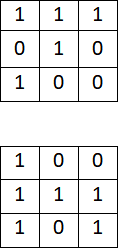

# Informal Reponse 4 (Feb. 25th) 

## Original 9X9 Matrix

## Filter

### Filter #1 [1,0,0], [1,1,1], [1,0,1]

### Filter # 2

### What is the purpose of using a 3x3 filter to convolve across a 2D image matrix?
* After an extensive google search, I have found that 3X3 filter allows for translation of the image. I have found out that, for example, a 3X1 multiply but the 3X3 matrix will still give you an 3X1 matrix. In addition we don't use an even filters because, "... odd filters are preferable because if we were to consider the final output pixel (of next layer) that was obtained by convolving on the previous layer pixels, all the previous layer pixels would be symmetrically around the output pixel. Without this symmetry, we will have to account for distortions across the layers." (Divyasri, icecreamlabs.com) 

Why would we include more than one filter? How many filters did you assign as part of your architecture when training a model to learn images of numbers from the mnist dataset?
* By applying more than one filter, we increase the accuracy of our network. I believe I have only applied one filter. 

## MSE: From your 400+ observations of homes for sale, calculate the MSE for the following.

### The 10 biggest over-predictions
* The Mean Squared Error is:  4387031.774105854

### The 10 biggest under-predictions
* The Mean Squared Error is:  144876414.91868272

### The 10 most accurate results (use absolute value)
* The Mean Squared Error is:  581.712493627384

In which percentile do the 10 most accurate predictions reside? Did your model trend towards over or under predicting home values?
* The ten most accurate predictions resided in between [$470,858 - $1,664,633], [2.8th - 95th percentile]. The prices that were on zillow are around [33th - 87th percentile]. 271 homes costed less than the predicted price and 51 costed more, hence over predicted. 

Which feature appears to be the most significant predictor in the above cases?
I am not too sure since location plays a huge role in the prices of homes. 

Stretch goal: calculate the MAE and compare with your MSE results

 
