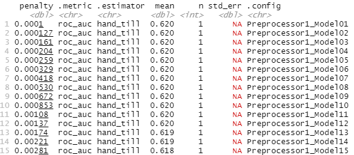
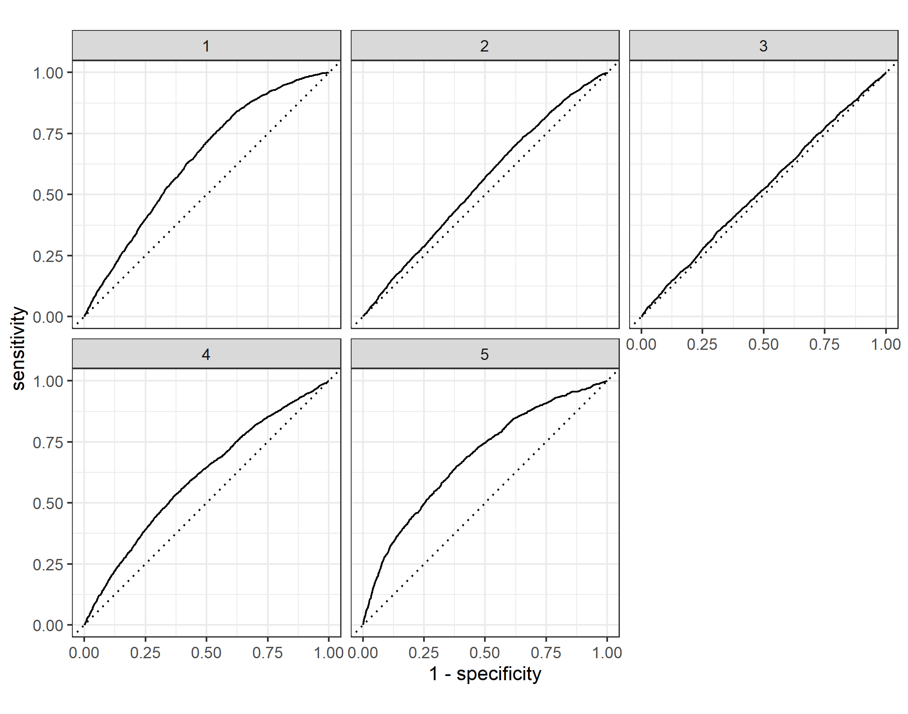

# Project 2 (J.Mo Yang)

### Selected Country: Albania
* I have selected Albania as the country to analyze in this project. I did have thoughts on other countries, however rather recent, DHS VII data was available for Albania. Also, as a student who learned a lot about the Middle East and Muslim countries, even though Albania is in Europe, it was intriguing for me to look into this data set.
  * Locations are divided into prefectures in this data set. 

#### Using the R script provided, split and sample your DHS persons data and evaluate the AUC - ROC values you produce. Which "top_model" performed the best (had the largest AUC)? 
* ##### Output 

  
  
  * Model 1 (penalty of 0.0001) to Model 12 (penalty of 0.00137) had the largest Mean AUC value of 0.620. As you can see from the graph, even though it is very slight, the graph begins to gradually decrease from the 12th point, then showing a sharp decrease starting from Model 26 (penalty of	0.0239). 

* ##### Linear Regression Plot 

  

  
#### Are you able to use the feature selection penalty to tune your hyperparameter and remove any potentially irrelevant predictors? Provide justification for your selected penalty value? 
* I sliced the model at 12 or (penalty of 0.00137), because it is the last model to have an AUC of 0.620. However, major fall off of AUC value does not happen until the 26th model. Nevertheless, the gradual decrease in AUC from model 1 to model 24 is great. (0.6203214 compared to 0.6043768). Therefore, I decided to pick the model where the value of the thousandth changes first. I beleieve this 12th model point is where irrelevent predictors are removed, becauase the AUC value begins to decrease.

#### Finally, provide your ROC plots and interpret them. How effective is your penalized logistic regression model at predicting each of the five wealth outcomes.
* ##### Top Model ROC Plot (Model 12)

* ##### Where AUC Falls off ROC Plot (Model 26)

* As we can see, the model does a good job of predicting Wealth Level 5, does a decent, but not great job of predicting Wealth Level 1 and 4. Also, it does a bad job of predicting Wealth Level 2 and 3. Also, as we can see, the Model 26 does not perform very well compared to Model 12. 

#### Set up your random forest model and produce the AUC - ROC values for the randomly selected predictors, and the minimal node size, again with wealth as the target. How did your random forest model fare when compared to the penalized logistic regression? Provide your ROC plots and interpret them. 
* AUC - ROC values of Randomly Selected Predictors & the Minimal Node Sizes

* ##### Comparison Between Random Forest and Penalized Logistic Regression

* ##### AUC Plot

* As we can see from the graph above the penalized logistic regression performed similarly to the random forest model. Even the AUC plot shows a similar trend as the penalized logistic regression model. 

#### Are you able to provide a plot that supports the relative importance of each feature's contribution towards the predictive power of your random forest ensemble model?
* ##### Output

#### Using the python script provided, train a logistic regression model using the tensorflow estimator API and your DHS data, again with wealth as the target.  Again produce your ROC curves and interpret the results.

#### Using the python script provided, train a gradient boosting model using decision trees with the tensorflow estimator. Provide evaluative metrics including a measure of accuracy and AUC. Produce the predicted probabilities plot as well as the ROC curve for each wealth outcome and interpret these results.

#### Analyze all four models. According to the evaluation metrics, which model produced the best results? 

#### Were there any discrepancies among the five wealth outcomes from your DHS survey dataset?
